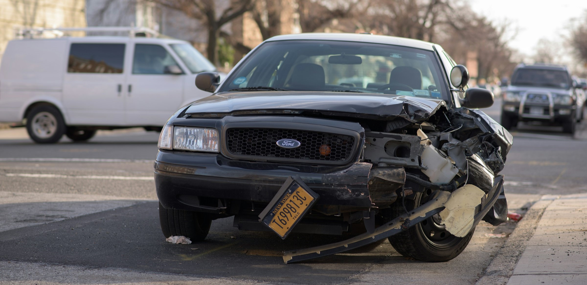
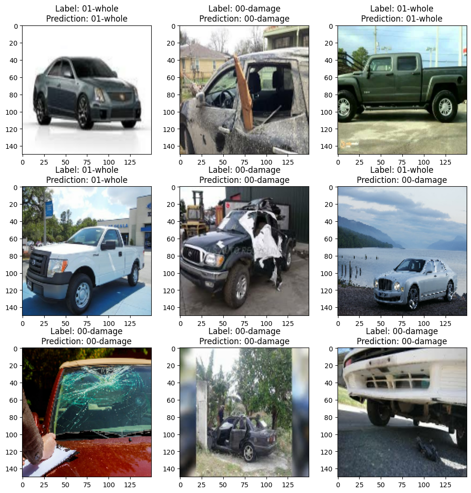
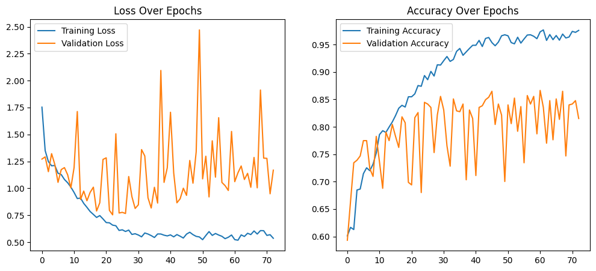
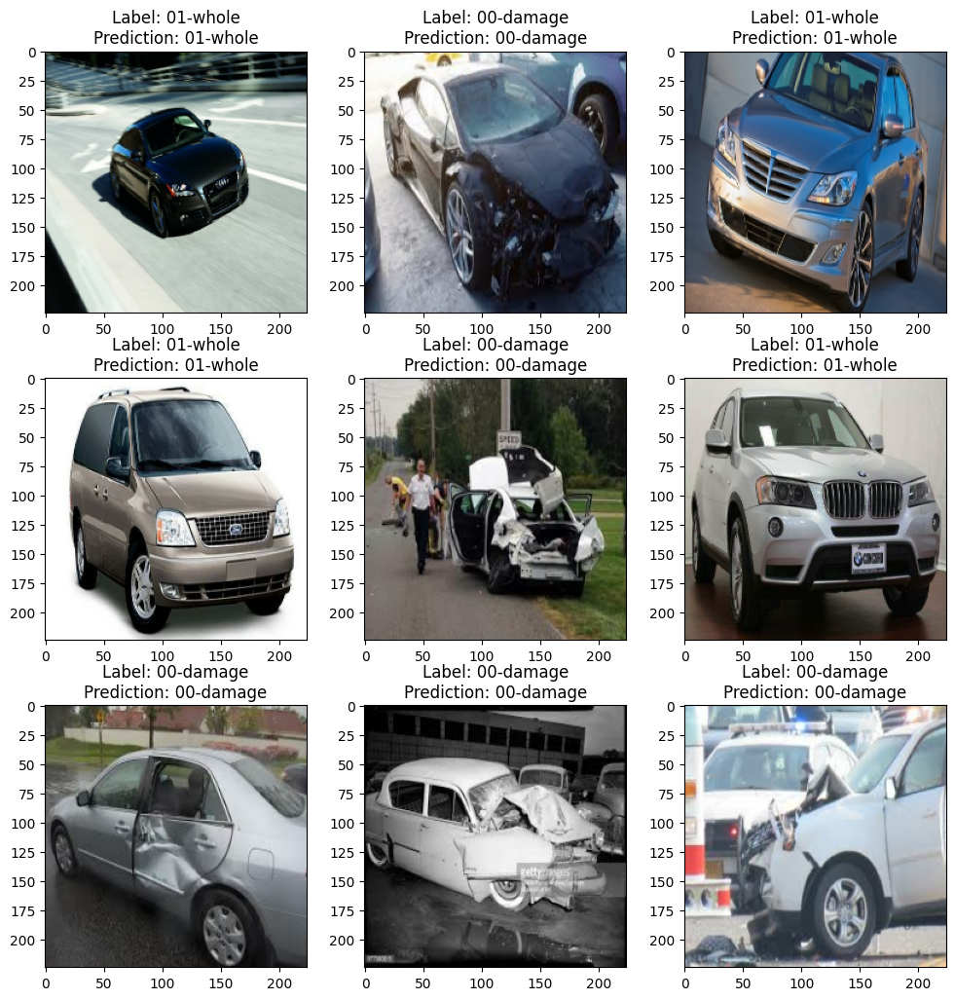
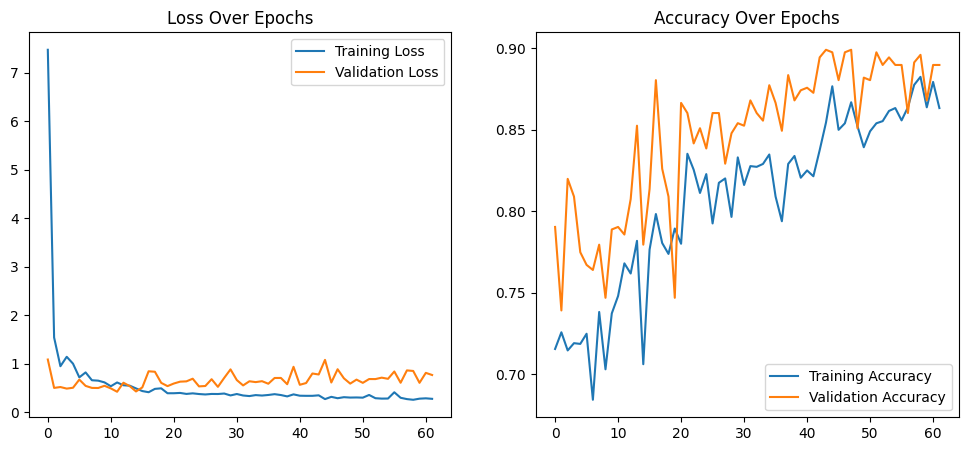
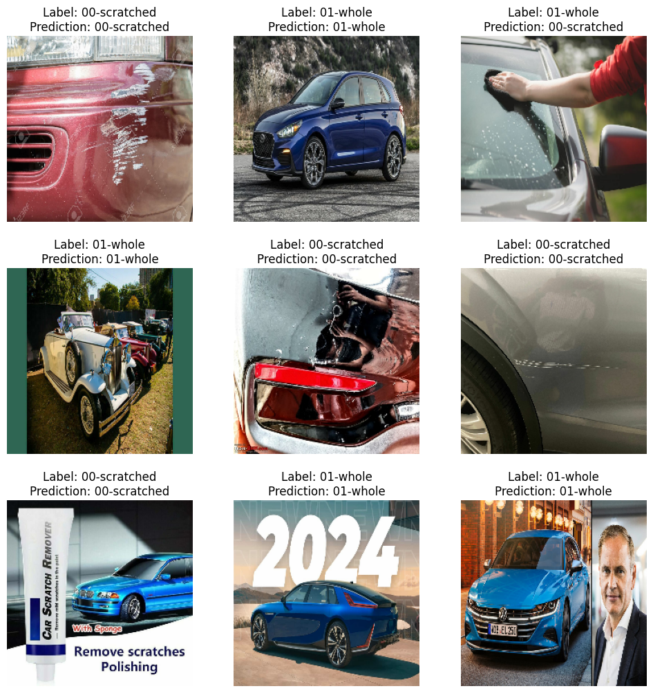
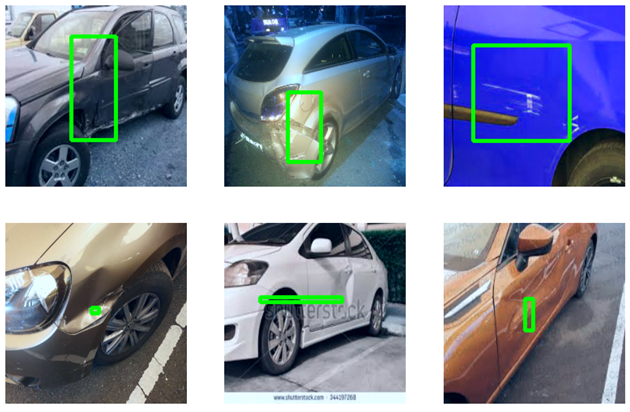
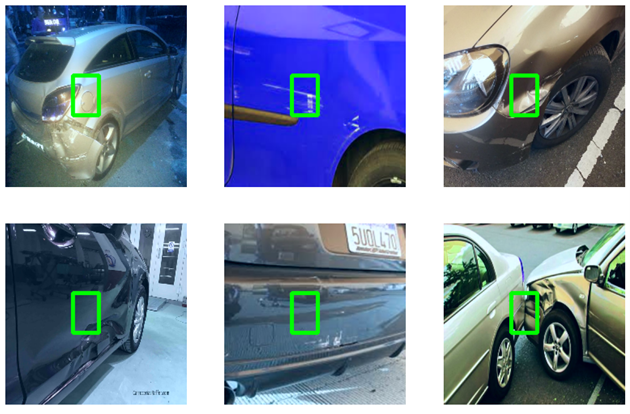

# Binary Car Damage Classification

by **Nicolas Liebau** and **Max Borm**

Foto von [Michael Jin](https://unsplash.com/de/@michaeljinphoto?utm_content=creditCopyText&utm_medium=referral&utm_source=unsplash) auf [Unsplash](https://unsplash.com/de/fotos/schwarzes-ford-auto-ipHlSSaC3vk?utm_content=creditCopyText&utm_medium=referral&utm_source=unsplash)

## Preamble

We would like to extend our heartfelt gratitude to the mentors at **[opencampus](https://edu.opencampus.sh/)** for their invaluable time and effort in guiding us through our first steps in deep learning using TensorFlow. Despite their busy schedules, they dedicated their free time to teaching us. Prior to this experience, we both had limited exposure to the topic; however, their passionate teaching inspired us to delve deeper into the field, even outside of the projects scope. This project was not just an academic exercise but a journey of discovery and fun, thanks to their support and encouragement. We are both eagerly looking forward to participating in another course on the topic. Our sincere thanks to each mentor at OpenCampus for making this journey possible and for inspiring us to continue learning about deep learning.

- **Thank you!**

### A note on the provided code

The code was initially written in Google Colab and thus was designed for it. It was written using Colab specific features like the Google Drive connectivity as well as with Neptune experiment tracking. These features were ripped out before hosting the code here. Although we tried to fix all this, some adjustments might be necessary to allow execution.

## Project Idea

The ambition of this project is to engineer a machine learning model capable of distinguishing between images of cars across various damage levels accurately. This classification serves critical real-world applications, particularly in:

- **Undamaged Cars**: Identifying vehicles without any damage.
- **Heavily Damaged Cars**: Categorizing cars that have sustained significant damage.
- **Cars with Minor Damage**: Recognizing vehicles with minor imperfections, such as scratches.

The initial concept for this project was contributed by a former group member who unfortunately had to leave the course due to other commitments. He provided an initial dataset of synthetically generated images of damaged vehicles. This dataset would have enabled the team to perform multiclass classification on the type and location of the damage. However, his departure resulted in the loss of access to this comprehensive dataset, leaving us with only a small subset insufficient for training purposes. Consequently, the scope and objectives of our project were revised to its current focus. In response to these challenges, we opted for a simpler model, placing a strong emphasis on achieving high accuracy and reliability. The shift of our focus also explains the unusual (but valid) decision of using 2 output neurons for binary classification, as the code for the output layers was taken from previous iterations and never revised.

## Objectives

The project's objectives are twofold:

1. **Detect Severe Damage**: Differentiate between undamaged cars and those with significant damage.
2. **Detect Minor Damage**: Identify cars that are undamaged versus those with minor damages like scratches.

## Business Case

The relevance of this project extends to numerous practical applications, such as:

- **Processing Insurance Claims**: Streamlining the assessment and processing of insurance claims.
- **Pre-purchase Vehicle Inspections**: Offering a more efficient way to inspect vehicles before purchase.
- **Automated Damage Assessment**: Facilitating damage assessment for car rentals or leasing services.

### Motivation

Key motivations behind this project include:

- Enhancing the efficiency and accuracy of damage assessment processes.
- Automating damage assessment to reduce manual inspection costs.
- Assisting consumers in making informed decisions when buying used cars.
- Improving customer experience in the insurance and car rental industries.

### Potential Benefits

Automating the identification and classification of vehicle damage could mitigate costs and errors associated with manual inspections, thereby reducing financial losses and increasing customer satisfaction. In an increasingly competitive insurance industry, image-based vehicle claim processing is becoming crucial, especially for frequent but smaller claims. Automation can offer convenience to both claimants and insurance companies, boosting productivity and enhancing overall customer satisfaction.

## Data Collection

To build the dataset for this project, an existing Google Image Scraping Application was utilized to automatically download images from the internet. The repository for this application can be found at [https://github.com/talleyhoe/google-image-scraper](https://github.com/talleyhoe/google-image-scraper). After cloning the repo and manually installing the dependencies, the images were curated manually to ensure their relevance, resulting in 622 images for no damage, 455 images for severe damage, and 338 images for minor damage. Additional images for severe damages and no damages were sourced from another project at [https://cainvas.ai-tech.systems/use-cases/car-damage-detection-app/](https://cainvas.ai-tech.systems/use-cases/car-damage-detection-app/).

### Image Scraping and Dataset Composition

The dataset was expanded and organized into training, validation, and test sets as follows:

- **Severe Damage**:

  - Train: 2246 files
  - Validation: 644 files
  - Test: 320 files

- **Minor Damage**:
  - Train: 444 files
  - Validation: 130 files
  - Test: 62 files

To address the skewed class distribution, techniques such as undersampling were considered to balance the dataset, ensuring the model's effectiveness across diverse damage classifications.

### Data Collection Detailed Overview

In the data collection phase of our project, we leveraged an existing Google Image Scraping Application for the automated download of images, which significantly expedited the process. The application we used is available at [https://github.com/talleyhoe/google-image-scraper](https://github.com/talleyhoe/google-image-scraper). After cloning the repository and manually installing the required dependencies, we executed the main script using Python to gather our initial dataset.

The images downloaded via the scraper were then meticulously checked by us to ensure they were suitable for our project's needs. This manual inspection process was crucial to maintaining the quality and relevance of our dataset. The initial result of this process was the collection of 622 images categorized as no damage, 455 images as severe damage, and 338 images as minor damage.

To further enhance our dataset, especially to balance the distribution between severe damages and no damages, we expanded our dataset with images from another project found at [https://cainvas.ai-tech.systems/use-cases/car-damage-detection-app/](https://cainvas.ai-tech.systems/use-cases/car-damage-detection-app/). This additional source provided us with a more comprehensive dataset to train our models more effectively.

#### Image Scraping and Dataset Expansion

For the severe damage category, after expansion, our dataset included:

- **Training set**: 2246 files (70% of the total)
- **Validation set**: 644 files (20%)
- **Test set**: 320 files (10%)

For the minor damage category, our dataset consisted of:

- **Training set**: 444 files (70%)
- **Validation set**: 130 files (20%)
- **Test set**: 62 files (10%)

This distribution was carefully chosen to optimize our model's learning and validation processes. Moreover, we encountered the challenge of a skewed class distribution, which is common in datasets for classification tasks. To address this issue and aim for a balanced class distribution, we explored undersampling techniques. This approach allowed us to reduce the imbalance by decreasing the number of samples in the overrepresented classes, aiming to equalize the presence of each class within our dataset and improve the model's ability to learn from a balanced set of examples.

## The Models

### CAR DAMAGE CLASSIFICATION - SEVERE DAMAGE

#### Deeper Model

##### Framework & Configuration

**Overview:**

- **Type:** Convolutional Neural Network (CNN)

**Customization & Architecture:**

- **Input:** 150x150 pixel images
- **Layers:**
  - Conv2D layers (4x)
  - MaxPooling2D
  - Batch Normalization
  - Dropout layers (0.3 and 0.5 rates) to prevent overfitting
  - L2 regularization
- **Output layer:** 2 neurons (softmax activation) for binary classification

**Training & Evaluation:**

- **Epochs:** ≈100
- **Callbacks:** Checkpoint saving and early stopping for efficient training
- **Manually selecting checkpoint for testing**

##### Evaluation

The previously described model reached an accuracy of 0.869 and a loss of 0.629.

### CAR DAMAGE CLASSIFICATION - SEVERE DAMAGE

#### Transfer Model V2

##### Overview:

- **Type:** Convolutional Neural Network (CNN) using TensorFlow & Keras
- **Base:** Pre-trained VGG16 (weights from ImageNet)

##### Customization & Architecture:

- **Input Size:** 224x224 pixels
- **Layers:**
  - Frozen VGG16 base for feature extraction
  - Flatten layer
  - Two Dense layers (128 and 64 neurons) with ReLU activation
  - Dropout layers (0.5 rate) after each Dense layer to prevent overfitting
- **Output layer:** 2 neurons (softmax activation) for binary classification

##### Training and Evaluation:

- **Optimizer:** Adam
- **Loss Function:** Categorical Crossentropy
- **Metrics:** Accuracy
- **Epochs:** 100
- **Evaluation:** The model was tested on a separate dataset to ensure unbiased performance evaluation.

The model achieved a remarkable accuracy of 91.87% and a loss of 0.589, demonstrating its effectiveness in classifying severe car damage with high precision.

### CAR DAMAGE CLASSIFICATION - MINOR DAMAGE

#### Transfer Model

##### Overview:

- **Type:** Convolutional Neural Network (CNN) using TensorFlow & Keras
- **Base Model:** Pre-trained VGG16 (weights from ImageNet)

##### Customization & Architecture:

- **Input Size:** 224x224 pixels
- **Layers:**
  - VGG16 base (frozen layers for feature extraction)
  - Flatten layer
  - Dense layers (128 and 64 neurons, ReLU activation)
  - Dropout layers (0.5 rate) for regularization
- **Output layer:** 2 neurons (softmax activation) for binary classification

##### Training and Evaluation:

- **Loss Function:** Categorical Crossentropy
- **Optimizer:** Adam
- **Metrics:** Accuracy
- **Epochs:** 15
- **Model evaluated on a separate testing set**

The model achieved an accuracy of 0.95 and a loss of 5.12.

### CAR DAMAGE CLASSIFICATION - BOUNDING BOXES

#### Overview

This part of the project was created more out of curiosity and explores an experimental approach to car damage classification focusing on identifying the location of the classified object or feature through bounding boxes. It represents trial-and-error learning experience, adopting transfer learning and regression to try and tackle the problem.

#### The Idea

The core idea involves using a single class with four output neurons corresponding to the coordinates of the bounding box: `x_start`, `y_start`, `x_end`, and `y_end`. This structure aims to pinpoint the precise location of car damage on images.

- **Base Model**: Utilizing VGG16 as the foundational architecture.
- **Neural Network Layers**:
  - A Dense layer with 512 units.
  - A Dropout layer with a rate of 0.5 to prevent overfitting.
  - Another Dense layer with 128 units.
  - A final Dense layer outputting 4 values to represent the two coordinates of a bounding box.

#### The Dataset

**Annotation overlayed on images pulled from the Dataset**

The dataset for this experimental phase was sourced from Kaggle due to time constraints. However, it presented significant challenges due to its obscure origins, lack of description, and suspicious quality. Despite these issues, the dataset's format oddly resembled that used by YOLO, suggesting it was designed for object detection tasks.

#### Results and Learning

**Sample predictions of the model**

The results are visibly underwhelming, with the model primarily averaging the start and end positions of bounding boxes, indicating a low correlation between the training dataset and actual damages. This outcome suggests that the data might not have been manually labeled but generated using a YOLO model, which itself may not have been highly accurate.

- **Key Takeaways**: The endeavor highlighted the critical importance of quality data and manual labeling in training effective machine learning models. The reliance on an inadequately labeled dataset, likely autogenerated by a suboptimal YOLO model, severely hampered the project's effectiveness in this experimental phase.

#### Reflection

This excursion into bounding box-based car damage classification, despite its setbacks, provided valuable lessons on the significance of dataset quality and the pitfalls of uncritically using third-party data. It underscores the necessity of rigorous data verification and the potential limitations of transfer learning when applied without a solid understanding of the data's origin and quality.

## Summary and Future Work

### Summary

**Severe Damage**:

- With a training set of 2246 files, a validation set of 644 files, and a test set of 320 files, our models performed as follows:
  - **Deeper model**: Achieved a test accuracy of 87% and a loss of 0.629.
  - **Transfer model**: Reached a test accuracy of 92% and a loss of 0.590.

**Minor Damage**:

- Utilizing a training set of 444 files, a validation set of 130 files, and a test set of 62 files, the performance was notable:
  - **Transfer model**: Attained a test accuracy of 95% and a loss of 5.128.

### Future Work

**Damage Detection**:

- Aim to train the model with a more diverse dataset containing different types of damage and label them accurately using polygons or brushes for enhanced precision.

**Damage Assessment**:

- Propose the development of classifications for each labeled damage type, such as scratches, chipped parts, chipped paint, and broken glass. Additionally, include markings to indicate the severity of the damage (e.g., low, medium, or high), which will offer more detailed insights into the extent of vehicle damage.

**Recognition of Car Parts**:

- An important future direction is the creation of a car part recognition system. This would involve identifying specific parts of the car, such as the boot, tyres, or front door, which is crucial for pinpointing and understanding the proportion of the damaged area compared to the total area of the vehicle part. This step is fundamental in advancing the precision of damage detection.
